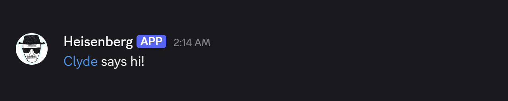
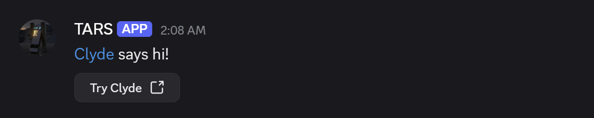
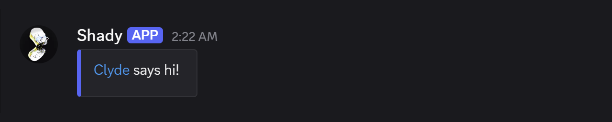

<p align="center">
  
</p>

<p align="center">
  <a href="https://pypi.org/project/discord-clyde/"></a>
  <a href="https://pypi.org/project/discord-clyde/"></a>
  <a href="https://github.com/EthanC/Clyde/actions/workflows/workflow.yaml"></a>
  <a href="https://codecov.io/gh/ethanc/clyde"></a>
  <a href="https://pypi.org/project/discord-clyde/"></a>
  <a href="LICENSE"></a>
</p>

<p align="center"><strong>Build rich Discord Webhook API interactions with a typed Python API.</strong></p>

Clyde supports plain messages, [Components](https://discord.com/developers/docs/components/overview), and rich [Embeds](https://discord.com/developers/docs/resources/message#embed-object) for the [Discord Webhook API](https://discord.com/developers/docs/resources/webhook). It validates each payload and sends it through synchronous or asynchronous HTTP methods.

## Features

- Type annotations across the public API
- Input type and field validation with [msgspec](https://github.com/jcrist/msgspec)
- Plain content, every webhook-compatible Discord Component, and field-level Embed controls
- Helpers for Discord-flavored Markdown and timestamps
- Synchronous and asynchronous HTTP requests through [niquests](https://github.com/jawah/niquests)
- Automatic retries when Discord returns a rate limit
- [API documentation](https://clyde.e3n.im/) generated with [Zensical](https://github.com/zensical/zensical)

## Installation

> [!IMPORTANT]
> Clyde requires Python 3.11 or later.

Add Clyde to a [uv](https://github.com/astral-sh/uv) project:

```console
uv add discord-clyde
```

## Examples

### Plain Message

```py
from clyde import Webhook

Webhook(
    url="https://discord.com/api/webhooks/00000/XXXXXXXXXX",
    avatar_url="https://i.imgur.com/RzkhQgZ.png",
    username="Heisenberg",
    content="[Clyde](https://github.com/EthanC/Clyde) says hi!",
).execute()
```

<p align="center">
  
</p>

### Message With Components

```py
from clyde import Webhook
from clyde.components import ActionRow, LinkButton, TextDisplay

webhook = Webhook(
    url="https://discord.com/api/webhooks/00000/XXXXXXXXXX",
    avatar_url="https://i.imgur.com/BpcKmVO.png",
    username="TARS",
)

webhook.add_component(
    [
        TextDisplay(content="[Clyde](https://github.com/EthanC/Clyde) says hi!"),
        ActionRow(
            components=[
                LinkButton(
                    label="Try Clyde",
                    url="https://github.com/EthanC/Clyde",
                )
            ]
        ),
    ]
).execute()
```

<p align="center">
  
</p>

### Message With an Embed

```py
from clyde import Embed, Webhook

Webhook(
    url="https://discord.com/api/webhooks/00000/XXXXXXXXXX",
    avatar_url="https://i.imgur.com/QaTHttz.png",
    username="Shady",
    embeds=[
        Embed(
            description="[Clyde](https://github.com/EthanC/Clyde) says hi!",
            color="#5865F2",
        )
    ],
).execute()
```

<p align="center">
  
</p>

## Releases

Clyde loosely follows [Semantic Versioning](https://semver.org/).

## Contributing

Bug fixes and new features are welcome. Read the [contribution guide](.github/CONTRIBUTING.md) before opening a pull request. Known bugs and feature requests are tracked in [GitHub Issues](https://github.com/EthanC/Clyde/issues).

## Acknowledgments

Discord owns the Clyde character and Discord brand assets. This project is not affiliated with or endorsed by Discord.
